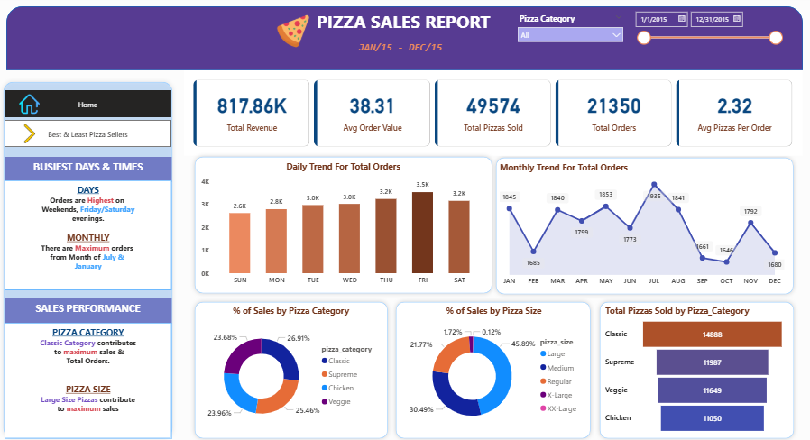
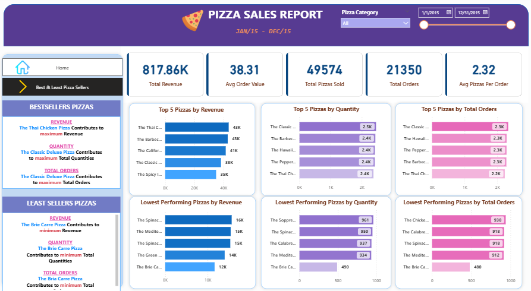

# 🍕 Pizza Sales Dashboard | Power BI + SQL

## 📊 Project Overview

This project analyzes pizza sales data to uncover meaningful business insights related to revenue, customer behavior, and product performance.

The goal was to transform raw transactional data into an interactive dashboard that helps stakeholders make data-driven decisions.

---

## 🎯 Business Problem

The business wants to understand:

* Which pizzas generate the most revenue?
* When are peak order times?
* What are the best and lowest performing products?
* How customer ordering behavior varies?

---

## 📌 Key KPIs

* 💰 Total Revenue: **817.86K**
* 🧾 Total Orders: **21,350**
* 🍕 Total Pizzas Sold: **49,574**
* 📊 Average Order Value: **38.31**
* 🔢 Avg Pizzas per Order: **2.32**

---

## 📈 Key Insights

### 🗓️ Sales Trends

* Peak order volume observed on **Fridays and Saturdays**
* Lowest activity seen mid-week → opportunity for promotions

### 🍕 Product Performance

* **Classic category** contributes highest revenue
* **Large size pizzas** generate maximum sales
* Identified clear gap between top and lowest performing pizzas

### 🥇 Top Performers

* Certain pizzas consistently rank in **Top 5 across revenue, quantity, and orders**
* These products drive a major share of business revenue

### 📉 Lowest Performers

* Some pizzas show **low demand across all metrics**
* Potential candidates for:

  * Menu optimization
  * Discounts or removal

---

## 📊 Dashboard Features

* Interactive filters (Date & Category)
* KPI cards for quick insights
* Trend analysis (Daily & Monthly)
* Top & Bottom performing products
* Category & Size contribution analysis

---

## 🛠️ Tools & Technologies

* **Power BI** → Data Visualization
* **SQL Server** → Data Analysis & Querying
* **CSV Dataset** → Raw Data Source

---

## 📂 Project Structure

## 📂 Project Structure

```plaintext
pizza-sales-dashboard/
│
├── dataset/
│   └── pizza_sales.csv
│
├── sql/
│   └── pizza_sales_queries.sql
│
├── dashboard/
│   └── pizza_sales_dashboard.pbix
│
├── images/
│   ├── home.png
│   └── best_least.png
│
├── README.md
├── LICENSE
└── .gitignore
```
---

## 📸 Dashboard Preview




---

## 💡 Recommendations

* Introduce promotions during low-performing weekdays
* Focus marketing on top-performing pizza categories
* Optimize or re-evaluate low-performing items
* Expand offerings in high-demand segments

---

## 🔗 Author

**Anirudh Pratap Shukla**
Data Analyst | SQL | Power BI

---

## ⭐ If you found this useful, feel free to star the repository!
